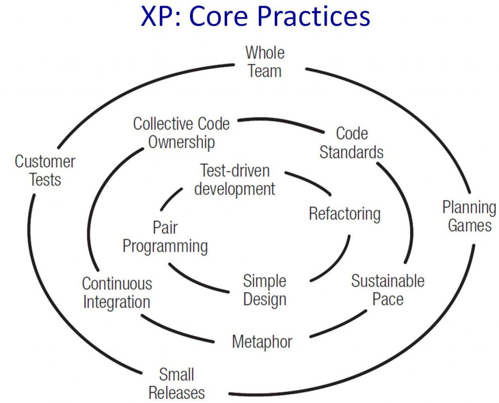

# 敏捷團隊的經驗

## 原因
一開始管理層決定使用Scrum模式的時候很開心，畢竟可以從三個月半年提一次需求變成每兩周都可以提需求，也可以讓工程師們來參與開會。工程師們為了每兩周的DeadLine，在寫程式之前沒有時間做研究或探索，累積的技術債越來越多，後期BUG堆疊的數量比完成的Feature還多。

### 想法
Scrum只有規定一些專案的流程與做法，但是並沒有說到程式該怎麼寫，才能維持程式的品質，快速的疊代加速累積的技術債，只會加速專案的崩潰。

### 有沒有軟體開發的方法論

這邊推薦極限開發(XP)的作法，最核心的部分為Pair Programming、TDD、Single Design、Refactoring，代表工程師必須要有以上4個技能才能開始極限開發，所以要快速疊代的基礎下倚賴的是工程師基本素質。

- Pair Programming代表的是溝通能力，可以與成員的討論並實作。
- TDD代表程式能力，可以寫出自己的想法並證明
- Refactoring代表需求的理解能力，能夠知道自己修改的範圍及功能。
- Simple Design代表抽象能力，可以用最小的方式完成需求。

在業界中關注的角度則是相反，大多的團隊會先搞CICD、Code Standards、Planning Game、Small Release，在這種情況下跑敏捷大多得到的結果都是負面的。

