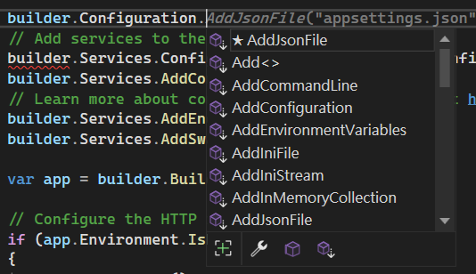
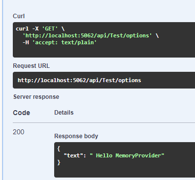

# 先看看AddOptions新增了哪些東西

``` C#
public static IServiceCollection AddOptions(this IServiceCollection services)
{
    ThrowHelper.ThrowIfNull(services);

    services.TryAdd(ServiceDescriptor.Singleton(typeof(IOptions<>), typeof(UnnamedOptionsManager<>)));
    services.TryAdd(ServiceDescriptor.Scoped(typeof(IOptionsSnapshot<>), typeof(OptionsManager<>)));
    services.TryAdd(ServiceDescriptor.Singleton(typeof(IOptionsMonitor<>), typeof(OptionsMonitor<>)));
    services.TryAdd(ServiceDescriptor.Transient(typeof(IOptionsFactory<>), typeof(OptionsFactory<>)));
    services.TryAdd(ServiceDescriptor.Singleton(typeof(IOptionsMonitorCache<>), typeof(OptionsCache<>)));
    return services;
}
```

IOptions、IOptionsSnapshot、IOptionsMonitor這三個設定大家都比較熟了，先跳過這些，來看看UnnamedOptionsManager的內容。

## UnnamedOptionsManager
``` C#
internal sealed class UnnamedOptionsManager<[DynamicallyAccessedMembers(Options.DynamicallyAccessedMembers)] TOptions> :
        IOptions<TOptions>
        where TOptions : class
    {
        private readonly IOptionsFactory<TOptions> _factory;
        private object? _syncObj;
        private volatile TOptions? _value;

        public UnnamedOptionsManager(IOptionsFactory<TOptions> factory) => _factory = factory;

        public TOptions Value
        {
            get
            {
                if (_value is TOptions value)
                {
                    return value;
                }

                lock (_syncObj ?? Interlocked.CompareExchange(ref _syncObj, new object(), null) ?? _syncObj)
                {
                    return _value ??= _factory.Create(Options.DefaultName);
                }
            }
        }
    }
```
看到如果沒有讀取過話會從IOptionsFactory去取得設定值。

## OptionsFactory
接下來看IOptionsFactory的[程式碼](https://github.com/dotnet/runtime/blob/af3393d3991b7aab608e514e4a4be3ae2bbafbf8/src/libraries/Microsoft.Extensions.Options/src/OptionsFactory.cs)。

``` C#
        foreach (IConfigureOptions<TOptions> setup in _setups)
            {
                if (setup is IConfigureNamedOptions<TOptions> namedSetup)
                {
                    namedSetup.Configure(name, options);
                }
                else if (name == Options.DefaultName)
                {
                    setup.Configure(options);
                }
            }
```

上面程式碼顯示了會有多個IConfigureOptions<TOptions>來設定options，代表可以有多個資料來源來更改Option，例如環境變數、launch、appsetting.json、appsetting[Env].json。


``` C#
            if (_validations.Length > 0)
            {
                var failures = new List<string>();
                foreach (IValidateOptions<TOptions> validate in _validations)
                {
                    ValidateOptionsResult result = validate.Validate(name, options);
                    if (result is not null && result.Failed)
                    {
                        failures.AddRange(result.Failures);
                    }
                }
                if (failures.Count > 0)
                {
                    throw new OptionsValidationException(name, typeof(TOptions), failures);
                }
            }
```
最後這段驗證Option。

## OptionsMonitor
``` C#
        public virtual TOptions Get(string? name)
        {
            if (_cache is not OptionsCache<TOptions> optionsCache)
            {
                // copying captured variables to locals avoids allocating a closure if we don't enter the if
                string localName = name ?? Options.DefaultName;
                IOptionsFactory<TOptions> localFactory = _factory;
                return _cache.GetOrAdd(localName, () => localFactory.Create(localName));
            }

            // non-allocating fast path
            return optionsCache.GetOrAdd(name, static (name, factory) => factory.Create(name), _factory);

        }
```
在Get的時候會使用IOptionsMonitorCache<TOptions>來讀取Option，原因是每次都要從Configuration來取的話浪費效能，畢竟IOptionsMonitor注入的Singleton。

## 如果我的環境變數會需要改變呢?

會發現IOptionsMonitor內有_onChange這個Property，當設定改變時會觸發這個Event來通知外部的訂閱者設定有改變。一般來說是改變appsetting的內容，檔案儲存時會觸發。
``` C#
 internal event Action<TOptions, string>? _onChange;
```

## 假設希望由程式中的變動而觸發OnChange呢?

可以看到HostBuilder可以新增很多Configuration的資料來源，也可以新增XML、CommandLine、Database來進行設定。來新增自己建立的MemorySource的設定，會發現有作用了。

``` C#
builder.Configuration.Add<MemorySource>((s) => { });
```
結果顯示設定已經被改變了。



## 如果要由API的變化來改變MemorySource的話該怎麼做?
注入相關的服務
``` C#
builder.Configuration.Add<MemorySource>((s) => { });
builder.Services.AddSingleton(s => builder.Configuration.Sources.OfType<MemorySource>().First());
builder.Services.AddHostedService<HostService>();
```

觸發API後有顯示Log。
``` log
info: Microsoft.Hosting.Lifetime[14]
      Now listening on: http://localhost:5062
info: Microsoft.Hosting.Lifetime[0]
      Application started. Press Ctrl+C to shut down.
info: Microsoft.Hosting.Lifetime[0]
      Hosting environment: Development
info: Microsoft.Hosting.Lifetime[0]
      Content root path: D:\bnn00023.github.io\src\Configure
info: Configure.HostService[0]
      Option changed to Text2
```